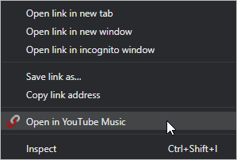

## &nbsp;YouTube to YouTube Music

Browser extension to open YouTube links in YouTube Music. Works on Chrome, 
Firefox, and Edge.

Demo - [https://kapoorlakshya.github.io/chrome-extension-to-open-youtube-links-in-youtube-music](https://kapoorlakshya.github.io/chrome-extension-to-open-youtube-links-in-youtube-music)

### Installation

First, clone the repository to your Desktop or wherever you want. Then,
follow these browser specific instructions:

#### Chrome

* Enter `chrome://extensions` in the URL bar.
* Enable **Developer mode** in the top right.
* Click on **Load unpacked…** on the left and select the extension's directory.

You should now see the extension in the list.

#### Firefox

* Enter `about:debugging` in the URL bar
* Click **Load Temporary Add-on**
* Open the extension's directory and select any file inside the extension.

You should now see the extension in the list. See the [official guide](https://developer.mozilla.org/en-US/docs/Mozilla/Add-ons/WebExtensions/Temporary_Installation_in_Firefox) for more information.

#### Edge

See the [official guide](https://docs.microsoft.com/en-us/microsoft-edge/extensions/guides/adding-and-removing-extensions) for instructions.

### Usage

Navigate to YouTube, right click any music video, and click on **Open in YouTube Music** in the context menu.

Additionally, you can open all `youtube.com` or `youtu.be` links from 
any other website. The extension enables the link in the context menu 
(right click menu) only if the URL you clicked on has `youtube.com` or 
`youtu.be` in it. Otherwise, the extension stays hidden.

#### "This video is not available" Error

Any video which is not categorized as "Music" is not available in 
YouTube Music, and will show a "This video is not available" error.